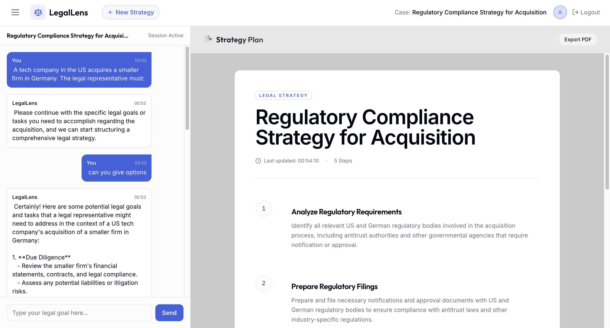

# LegalLens ⚖️

> **AI-Powered Legal Strategy Architect**

LegalLens is a full-stack AI application designed to help legal professionals and individuals act as an intelligent co-pilot for structuring complex legal strategies. It features a split-view interface with a context-aware AI chat on the left and a live, structured plan document on the right.

 *(Add a screenshot here)*

## 🔴 Live Demo

**Try the app here:** [https://legal-lens-ruby.vercel.app/](https://legal-lens-ruby.vercel.app/)

## ✨ Features

*   **Dual-Pane Workflow**: Seamlessly switch between chatting and viewing your structured plan.
*   **Context-Aware AI**: The AI "sees" your plan live. Ask "Change step 3" and it knows exactly what to do.
*   **Persistent Sessions**: Your strategies and chat history are saved automatically.
*   **Secure Authentication**: User registration and login with JWT and BCrypt security.
*   **Modern UI**: Built with Svelte and Tailwind CSS for a premium, fast, and responsive experience.
*   **Scalable Backend**: Powered by FastAPI and MongoDB (Motor/Beanie) for high performance.

## 🛠️ Tech Stack

### Backend
*   **API Framework**: [FastAPI](https://fastapi.tiangolo.com/) (Python 3.10+)
*   **Database**: [MongoDB Atlas](https://www.mongodb.com/cloud/atlas)
*   **ODM**: [Beanie](https://beanie-odm.dev/) (Async MongoDB ODM)
*   **AI**: [OpenAI GPT-4o](https://platform.openai.com/) (via streaming API)
*   **Testing**: `pytest` + `httpx`
*   **Deployment**: [Render](https://render.com)

### Frontend
*   **Framework**: [Svelte](https://svelte.dev/) + [Vite](https://vitejs.dev/)
*   **Styling**: [Tailwind CSS](https://tailwindcss.com/)
*   **State Management**: Svelte Stores (built-in)

---

## 🚀 Getting Started

### Prerequisites
*   Node.js (v18+)
*   Python (v3.10+)
*   MongoDB Cluster (Free M0 Tier on Atlas is perfect)
*   OpenAI API Key

### Installation

1.  **Clone the repository**
    ```bash
    git clone https://github.com/yourusername/legallens.git
    cd legallens
    ```

2.  **Setup Backend**
    ```bash
    cd backend
    python -m venv venv
    source venv/bin/activate  # or venv\Scripts\activate on Windows
    pip install -r requirements.txt
    ```

3.  **Configure Environment**
    Create a `.env` file in the `backend/` directory:
    ```env
    OPENAI_API_KEY=your_openai_key
    MONGODB_URL=your_mongodb_connection_string
    SECRET_KEY=your_random_secret_string
    DATABASE_NAME=legal_lens
    ```

4.  **Run Backend**
    ```bash
    uvicorn main:app --reload
    # Server running at http://localhost:8000
    ```

5.  **Setup Frontend**
    Open a new terminal:
    ```bash
    cd frontend
    npm install
    npm run dev
    # App running at http://localhost:5173
    ```

---

## 🌍 Deployment

## 🌍 Deployment

You can see the running application here: [https://legal-lens-ruby.vercel.app/](https://legal-lens-ruby.vercel.app/)

We recommend a **Split Deployment** strategy for the best free-tier performance:

1.  **Frontend**: Deploy on [Vercel](https://vercel.com) (Free).
2.  **Backend**: Deploy on [Render](https://render.com) (Free).
3.  **Database**: Host on [MongoDB Atlas](https://mongodb.com/atlas) (Free).

👉 **[Read the Full Deployment Guide](docs/deployment_guide.md)**

## 🧪 Testing

Run the backend test suite to verify API and DB logic:

```bash
cd backend
pytest -v
```

## 📄 License

MIT License.
